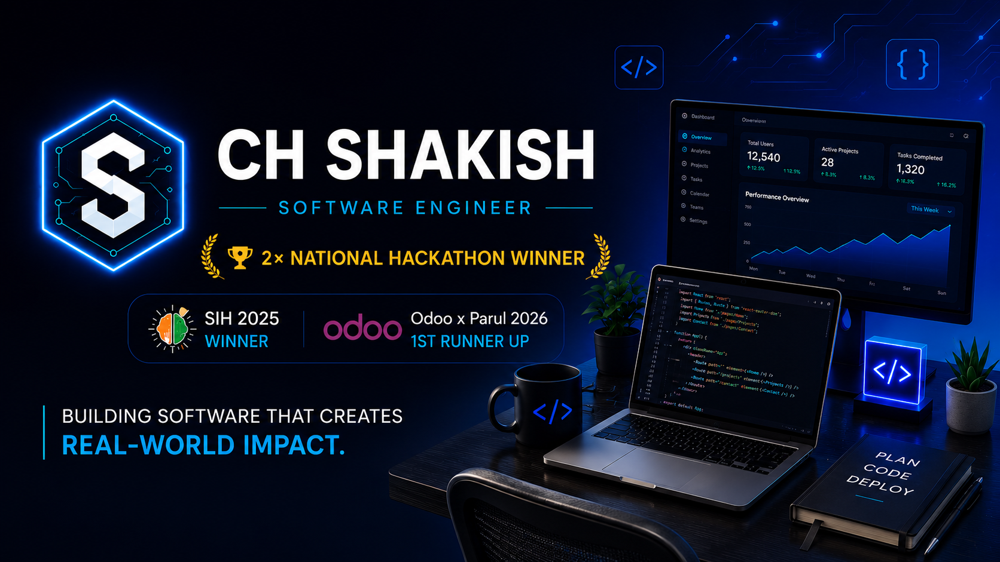
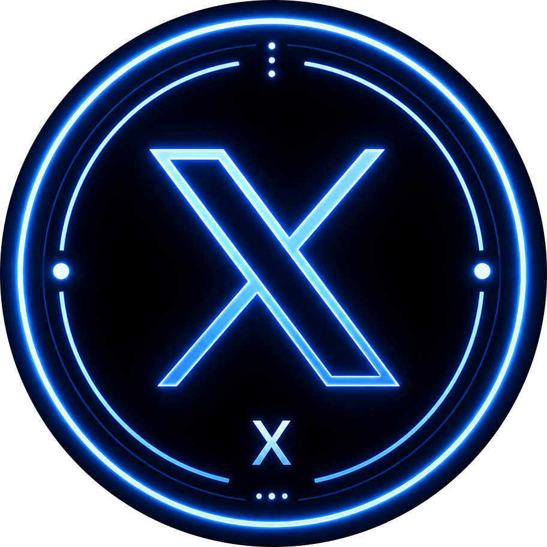
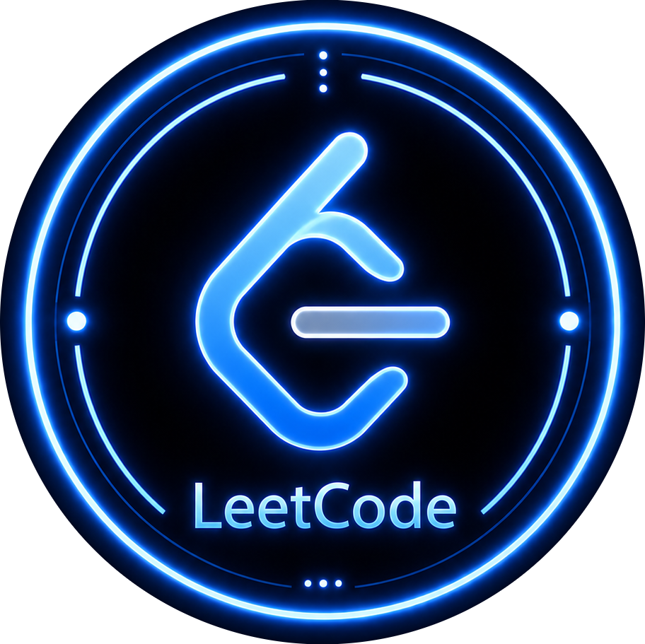
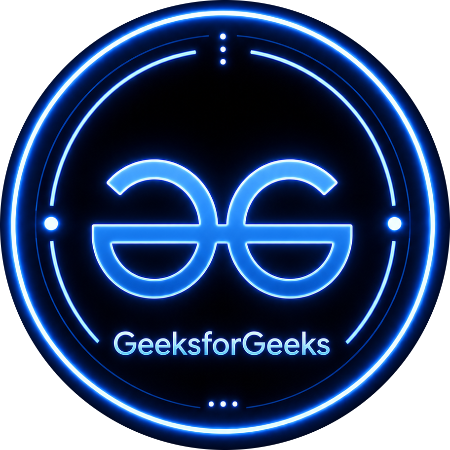

<!-- ========================================================= -->
<!--                          HERO                             -->
<!-- ========================================================= -->

 

<h1 align="center">
Hi 👋 I'm <b>CH SHAKISH</b>
</h1>

<h3 align="center">
Software Engineer • Full Stack • Flutter
</h3>

 

 

Passionate about building impactful software through
<b>Full Stack Development</b>,
<b>Flutter</b>, and
<b>Scalable System Design</b>.
I enjoy transforming ideas into products that solve real-world problems.

📍 <b>Open to Software Engineering • Full Stack • Flutter Opportunities</b>

 

## ⚡ Quick Navigation

🏆 <a href="#-achievements--recognition">Achievements</a> •
🚀 <a href="#-engineering-mindset">Mindset</a> •
🛠 <a href="#-tech-arsenal">Tech Stack</a> •
💼 <a href="#-featured-work">Projects</a> •
📈 <a href="#-contribution-activity">Contributions</a> •
💭 <a href="#-engineering-philosophy">Philosophy</a> •
🤝 <a href="#-lets-connect">Contact</a>

 

## 🌐 Connect With Me

 

&nbsp;&nbsp;

&nbsp;&nbsp;

&nbsp;&nbsp;

&nbsp;&nbsp;

&nbsp;&nbsp;

&nbsp;&nbsp;

 

 
<!-- ========================================================= -->
<!--               ACHIEVEMENTS & RECOGNITION                  -->
<!-- ========================================================= -->

# 🏆 Achievements & Recognition

> *A journey of building impactful products, leading communities, and competing at the national level.*

 

## 🏆 National Hackathon Achievements

### 🥇 Smart India Hackathon 2025 (Winner)
**National Winner • India's Largest Innovation Competition**

🚀 **[EasyERP](https://github.com/TLE-Smashers/EasyERP-SIH)**

Built EasyERP, a modern ERP platform that streamlines educational administration through **Geo-Fenced Attendance, Role-Based Access Control, Multilingual Support, and Intelligent Workflow Automation.**

### 🥈 Odoo x Parul University Hackathon 2026 (First Runner-Up)
**National First Runner-Up • 100+ Teams**

🚀 **[Odoo Cafe POS](https://github.com/Shreyansh-32/OdooxPHCafe-pos)**

Built a complete Cafe POS ecosystem featuring **QR Ordering, Kitchen Display System (KDS), Cashier Dashboard, and Real-Time Order Management.**

---
 

## 🌟 Leadership & Recognition

| Recognition | Highlights |
|-------------|-------------|
| 🚀 **Google Developer Student Clubs (2023-2025)** | **Core Team → Technical Co-Lead → Co-Lead** • Organized workshops, coding competitions, technical events and mentored aspiring developers. |
| 🏆 **Technova Ideathon 2024** | Winner • LCIT Bilaspur |
| 🥈 **IEEE ICECCT 2024** | Runner-Up • **Nijaat Healthcare Solution** • **Secured ₹2 Lakh Development Grant** |
| 🏅 **AIR 483 (2024)** | AIR 483 among thousands of participants in Tricolor CodeFest. |

---
 

## 💻 Competitive Programming

✔ 600+ DSA Problems Solved

✔ Strong Foundation in Data Structures & Algorithms

✔ Active Competitive Programmer

✔ Regular Practice across LeetCode, GeeksforGeeks & Coding Ninjas

 

<!-- ========================================================= -->
<!--                ENGINEERING MINDSET                        -->
<!-- ========================================================= -->

# 🚀 Engineering Mindset

> *The mindset that drives the way I build software.*

Software engineering, for me, is more than writing code—it's about solving meaningful problems, collaborating with people, and building technology that creates lasting impact.

My journey has been shaped by building production-ready applications, leading developer communities, competing in national hackathons, and continuously improving through competitive programming.

> **"Great software isn't measured by the technologies it uses, but by the value it creates for people."**

Every project is an opportunity to learn, improve, and build software that delivers real-world value.

 

# ⚡ Professional Snapshot

> *Quick facts about my engineering journey.*

| 🏷️ Labels | Details |
|:---|:--------|
| 🏆 **Achievements** | 1× National Winner • 1× National First Runner-Up |
| 🚀 **Leadership** | Core Team → Technical Co-Lead → Co-Lead, Google Developer Student Clubs |
| 🎓 **Education** | B.Tech Information Technology (GECB)|
| 💼 **Specialization** | Full Stack Engineering • Flutter Development • Backend Systems |
| 🧠 **Currently Exploring** | System Design • Cloud Architecture • Distributed Systems |
| 🌍 **Open To** | Software Engineering • Full Stack • Flutter • Backend Roles |
| 📍 **Based In** | Chhattisgarh, India |

---

### "Engineering software that creates real-world impact, one project at a time." 🚀

 

<!-- ========================================================= -->
<!--                 TECH ARSENAL                              -->
<!-- ========================================================= -->

# 🛠 Tech Arsenal

> *Technologies I use to design, build, and deploy production-ready software.*

---

### 💻 Programming Languages

*Primary languages for software engineering, competitive programming, and application development.*

---

### 🎨 Frontend & Mobile

*Building responsive web applications and high-performance cross-platform mobile experiences.*

---

### ⚙️ Backend & APIs

*Designing scalable backend services, authentication systems, and RESTful APIs.*

`REST API` • `JWT` • `Firebase Authentication`

---

### ☁️ Databases & Cloud

*Working with databases, cloud services, containerization, deployment, and DevOps workflows.*

---

### 🎯 UI / UX Design

*Designing intuitive user experiences through wireframes, prototypes, and modern design systems.*

`UI Design` • `UX Design` • `Wireframing` • `Prototyping` • `Design Systems` • `Responsive Design`

---

### 🔧 Development Tools

*Tools that power efficient development, collaboration, version control, API testing, and deployment.*

---

### 🧠 Computer Science Fundamentals

✔ Data Structures & Algorithms

✔ Object-Oriented Programming

✔ Database Management Systems

✔ Operating Systems

✔ Computer Networks

✔ Low-Level System Design (LLD)

✔ High-Level System Design (HLD)

 

<!-- ========================================================= -->
<!--                   FEATURED WORK                           -->
<!-- ========================================================= -->

# 🚀 Featured Projects

> *A selection of products I've built to solve real-world problems through software engineering.*

---

## 🏆 [EasyERP](https://github.com/TLE-Smashers/EasyERP-SIH)

Cloud-native ERP platform for educational institutions featuring geo-fenced attendance, multilingual support, role-based access control, and workflow automation.

🏆 **Smart India Hackathon 2025 Winner**

**⚙ Built With**

`Next.js` • `Google Apps Script` • `Firebase`

---

## 🥈 [Odoo Cafe POS](https://github.com/Shreyansh-32/OdooxPHCafe-pos)

End-to-end Cafe POS ecosystem featuring QR Ordering, Kitchen Display System (KDS), Cashier Dashboard, and real-time order management.

🥈 **National First Runner-Up — Odoo × Parul University Hackathon 2026**

**⚙ Built With**

`Odoo` • `Python` • `JavaScript` • `PostgreSQL`

---

## 💼 [AssetMate](https://github.com/CHSHAKISH/AssetMate)

Inventory and asset management platform designed to streamline asset tracking, inventory monitoring, and resource management.

💼 **Successfully delivered as a Freelance Client Project**

**⚙ Built With**

`React.js` • `Firebase` • `Tailwind CSS`

---

## 🏫 [Shiksha Sanchalan](https://github.com/CHSHAKISH/Shiksha-Sanchalan)

Examination management platform automating seat allocation, invigilation scheduling, faculty allocation, and timetable generation.

🏫 **Successfully deployed for pilot testing at Government Engineering College Bilaspur.**

**⚙ Built With**

`Flutter` • `Firebase`

---

### ⭐ More projects are available in my pinned repositories and GitHub portfolio.

 

<!-- ========================================================= -->
<!--               CONTRIBUTION ACTIVITY                       -->
<!-- ========================================================= -->

# 📈 Contribution Activity

> *Consistency is built one commit at a time.*

 

💙 **Every commit reflects continuous learning, consistency, and craftsmanship.**

 
<!-- ========================================================= -->
<!--                    CONTRIBUTION SNAKE                    -->
<!-- ========================================================= -->

# 🐍 Contribution Snake

<i>Every contribution adds another step to the journey.</i>

  

<picture>

<source
media="(prefers-color-scheme: dark)"
srcset="https://raw.githubusercontent.com/CHSHAKISH/CHSHAKISH/output/github-contribution-grid-snake-dark.svg">

</picture>

 
<!-- ========================================================= -->
<!--                ENGINEERING PHILOSOPHY                     -->
<!-- ========================================================= -->

# 💭 Engineering Philosophy

> *The principles that shape the way I build software.*

> **"Technology is most valuable when it solves meaningful problems for real people."**

I enjoy building software that is **useful**, **scalable**, and **intuitive**—whether it's a national hackathon project, a production-ready application, or an open-source contribution.

Every project is an opportunity to learn, improve, and build software that creates measurable real-world impact.

 

# 🤝 Let's Connect

### ⭐ Thanks for visiting!

I'm always open to collaborating on impactful software, open-source contributions, hackathons, and innovative ideas.

&nbsp;&nbsp;

&nbsp;&nbsp;

 

### 🚀 Let's build technology that creates real-world impact together.

